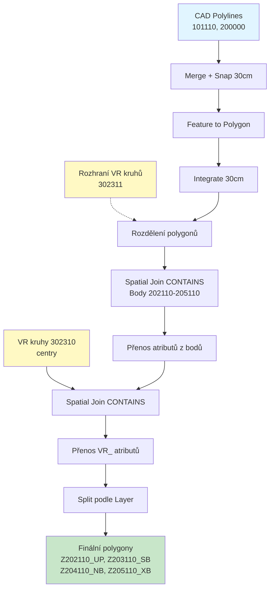
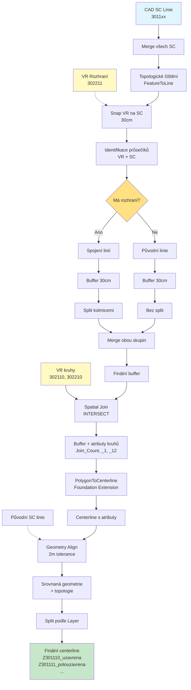

# CAD to GIS Import Toolbox

Python toolboxy pro ArcGIS Pro určené pro import a zpracování CAD dat s automatickou analýzou. Sada obsahuje dva specializované převodníky pro územní plánování.

## Hlavní vlastnosti

✅ **Profesionální architektura**
- Centralizácia konstant pro všechny geometrické tolerance
- Automatický cleanup manager pro dočasné vrstvy
- Komplexní error handling s validací vstupů
- Detailní dokumentace všech geometrických operací

✅ **Robustní zpracování**
- Validace a oprava geometrie před zpracováním
- Fallback strategie při selhání primárních metod
- Context managery pro bezpečnou práci s workspace
- Automatické čištění i při chybách

✅ **Konfigurovatelnost**
- Všechny tolerance jako konstanty (jednoduchá změna)
- Jasně definované geometrické parametry
- Flexibilní nastavení pro různé typy dat

## Přehled toolboxů


### 1. Převodník Řešených území (Prevodnik_CAD_GIS_ReseneUzemi.pyt)

Import a analýza hraničních území s kontrolou bodů

Hlavní funkce:
- Převod polyline vrstev do polygonů se geometrickým čištěním
- Prostorová analýza bodových vrstev a jejich propojení s polygony
- Automatické vyčištění geometrie s tolerancí 30 cm
- Vytváření samostatných vrstev dle typu a detekce problematických prvků
- Rozdělení polygonů podle výškových rozhraní (302311)
- Přenos výškových atributů z kruhů (302310) na polygony s prefixem VR_

Workflow Řešených území:



Vstupní vrstvy:
- 101110_PL_Resene_uzemi (Polyline) - hranice řešeného území
- 200000_PL_Cast_uzemi (Polyline) - hranice částí území
- 101111_BL_Resene_uzemi (Point) - kontrolní bod řešeného území
- 202110_BL_Cast_uzemi_UP (Point) - body územního plánu
- 203110_BL_Cast_uzemi_SB (Point) - body stavebních bloků
- 204110_BL_Cast_uzemi_NB (Point) - body nadzemních budov
- 205110_BL_Cast_uzemi_XB (Point) - body ostatních objektů
- 302310_BL_VR_na_plochu (Polyline) - výškové kruhy na plochu
- 302311_PL_VR_na_plochu_rozhrani (Polyline) - výškové rozhraní ploch

### 3. Převodník Výšek (Prevodnik_CAD_GIS_Vysky.pyt)

Import a zpracování výškových regulativů na liniích

Hlavní funkce:
- Automatická detekce všech SC vrstev (301110-301119 a další)
- Merge stavebních čar s pokročilým topologickým čištěním
- Snap výškových rozhraní (VR) na stavební čáry
- Rozdělení bufferů podle rozhraní pomocí kolmých řezných čar
- Vytvoření centerline z bufferů s zachováním atributů
- Geometrické srovnání s původními liniemi
- Fallback režim při absenci rozhraní (302211)

Workflow Výšek:



Vstupní vrstvy:
- 3011xx_PL_SC_* - stavební čáry všech typů (automatická detekce)
- 302110_BL_VR_na_bod (Polyline) - výškové kruhy na bod
- 302210_BL_VR_na_linii (Polyline) - výškové kruhy na linii
- 302211_PL_VR_na_linii_rozhrani (Polyline) - výškové rozhraní linií (volitelné)

## Společné funkce

Automatické zpracování:
- Validace názvů s sanitizací speciálních znaků
- Automatické generování jedinečných názvů
- Automatická detekce a reprojekce souřadnicových systémů (default S-JTSK EPSG:5514)
- Geometrické tolerance: XY tolerance 0.01m, XY resolution 0.001m

## Výstupy

### Převodník Řešených území

Polygonové vrstvy:
- ZResene_uzemi_PL - polygony vytvořené z linií
- Z202110_BL_Cast_uzemi_UP - polygony podle Layer atributu
- Z203110_BL_Cast_uzemi_SB - polygony podle Layer atributu
- Z204110_BL_Cast_uzemi_NB - polygony podle Layer atributu
- Z205110_BL_Cast_uzemi_XB - polygony podle Layer atributu
- ZResene_uzemi_Polygon_with_Points - polygon území s analýzou bodů

Vrstvy s problémovými prvky:
- ZPolygony_bez_bodu - polygony bez připojeného bodu (Join_Count = 0)
- ZPolygony_vice_bodu - polygony s více body (Join_Count > 1)
- ZPolygony_mimo_uzemi - polygony mimo hranice řešeného území

Ostatní vrstvy:
- Z101110_PL_Resene_uzemi_LN - původní linie území
- Z200000_PL_Cast_uzemi_LN - původní linie částí území

### Převodník Výšek

Hlavní výstupy:
- Z3011xx_PL_SC_* - centerline vrstvy rozdělené podle typu SC
- Z302110_BL_VR_na_bod - výškové kruhy na bod (pouze kruhy)

Atributy zachované v centerline:
- **Layer**: Identifikace původní SC vrstvy (301110, 301111, atd.) - potřebné pro split
- **Join_Count**: Počet kruhů které se protínají s centerline
- **Výškové atributy**: VYSKA_VB, VYSKA_VB_I, VYSKA_VB_D
- **Regulační hodnoty**: NP_MIN, NP_MAX, NUP_MAX
- **Výškové limity**: RIMSA_MIN, RIMSA_MAX, VYSKA_MAX
- **Dokumentace**: NAZEV_BLOK, DOK_NAZEV
- **Klasifikace**: OZNACENI, DRUH_UP, DRUH_INFO, PODTYP

Suffixy atributů:
- **Bez suffixu**: původní atributy ze SC linie (OZNACENI, VYSKA_VB...)
- **_1**: atributy z rozhraní (302211) NEBO z kruhů pokud linie nemá rozhraní
- **_12**: atributy z kruhů (302110/302210) pokud linie má rozhraní

Poznámka: CAD metadata (Entity, Handle, Color, Linetype, atd.) se automaticky odstraňují z finálních vrstev.

## Hodnocení kvality dat (Řešená území)

Pole "bod" - status bodů:
- v pořádku (Join_Count = 1) - prvek má přiřazen právě jeden bod
- bez bodu (Join_Count = 0) - prvek nemá žádný připojený bod
- více bodů (Join_Count > 1) - prvek má připojeno více bodů

Pole "pozice_resene_uzemi":
- uvnitř řešeného území - polygon leží kompletně uvnitř hranic
- mimo řešené území - polygon leží mimo hranice

Pole výškových atributů (pokud je vrstva 302310):
- **Výškové hodnoty**: VR_VYSKA_VB, VR_VYSKA_VB_I, VR_VYSKA_VB_D
- **Regulační limity**: VR_NP_MIN, VR_NP_MAX, VR_NUP_MAX
- **Výškové rozsahy**: VR_RIMSA_MIN, VR_RIMSA_MAX, VR_VYSKA_MAX
- **Dokumentace**: VR_NAZEV_BLOK, VR_DOK_NAZEV
- **Klasifikace**: VR_OZNACENI, VR_DRUH_UP, VR_DRUH_INFO, VR_PODTYP

Pozn: Výškové body (302310) se nezapočítávají do hodnocení "bod"

## Instalace

Požadavky:
- ArcGIS Pro 2.8 nebo novější
- Python 3.x (součást ArcGIS Pro)
- Licenční úroveň Standard nebo Advanced
- Foundation/Production Mapping extension (volitelné - pro převodník výšek)
  * S Foundation extension: vytvoří se centerline pomocí PolygonToCenterline (nejlepší kvalita)
  * Bez Foundation extension: použije se Python balíček 'centerline' (Voronoi diagram)
  * Instalace fallback balíčku: pip install centerline (volitelné, pouze pokud nemáte Foundation)

Postup:
1. Stáhněte soubory:
   - Prevodnik_CAD_GIS_ReseneUzemi.pyt (řešená území)
   - Prevodnik_CAD_GIS_Vysky.pyt (výšky)
2. Zkopírujte do složky s ArcGIS Pro projektem
3. V ArcGIS Pro: Catalog Pane - Toolboxes - Add Toolbox
4. Vyberte požadovaný .pyt soubor (jeden nebo oba)
5. Oba převodníky mohou být použity nezávisle nebo kombinovaně

## Použití

### Převodník Řešených území

Základní workflow:
```
CAD soubor → Načtení vrstev → Automatický výběr → Export a zpracování → Výsledné vrstvy
```

Parametry:
- Input CAD Soubor - cesta k DWG/DXF/DGN
- CAD Vrstva(y) - automaticky předvolené (101110, 200000, 101111, 202110-205110, 302310, 302311)
- Output Geodatabáze - povinný
- Output Feature Dataset - volitelný
- XY Tolerance - 0.01 m (default)
- XY Resolution - 0.001 m (default)
- Output Souřadnicový Systém - auto/S-JTSK
- Geographic Transformation - volitelný
- Prefix jména výstupu - Z (default)

### Převodník Výšek

Základní workflow:
```
CAD soubor → Načtení vrstev → Automatický výběr → Export a zpracování → Výsledné vrstvy
```

Parametry:
- Input CAD Soubor - cesta k DWG/DXF/DGN
- CAD Vrstva(y) - automaticky předvolené (3011xx SC vrstvy, 302110, 302210, 302211)
- Output Geodatabáze - povinný
- Output Feature Dataset - volitelný
- XY Tolerance - 0.01 m (default)
- XY Resolution - 0.001 m (default)
- Output Souřadnicový Systém - auto/S-JTSK
- Geographic Transformation - volitelný
- Prefix jména výstupu - PL_ (default)

### Kombinované použití obou převodníků

Pokud potřebujete zpracovat oba typy dat (podrobný postup):

1. **Nejprve spusťte Převodník Řešených území:**
   - Input CAD: váš DWG/DXF soubor
   - Output GDB: vaše geodatabáze
   - Output FD: např. "Resene_uzemi"
   - Prefix: "Z"
   - Výsledek: polygony Z202110_UP, Z203110_SB atd.

2. **Poté spusťte Převodník Výšek:**
   - Input CAD: stejný DWG/DXF soubor
   - Output GDB: stejná geodatabáze
   - Output FD: stejný nebo jiný (např. "Vysky")
   - Prefix: "PL_"
   - Výsledek: centerline PL_Z301110, PL_Z301111 atd.

3. **Výsledek:**
   - Obě sady vrstev v jedné geodatabázi
   - Možnost použít stejný nebo odlišný feature dataset
   - Vrstvy se navzájem neovlivní

### Spuštění toolboxů
### Spuštění toolboxů

1. Otevřete příslušný toolbox v ArcGIS Pro
2. Spusťte tool (Export Layer)
3. Nastavte parametry (CAD soubor, geodatabáze)
4. Vrstvy se automaticky předvyberou dle typu
5. Spusťte a ověřte výsledky

## Konfigurace

### Geometrické konstanty (GeometryConstants)

**Řešená území:**
```python
SNAP_TOLERANCE = 0.3        # metry - tolerance pro snap operace
BUFFER_DISTANCE = 0.3       # metry - vzdálenost bufferu
BUFFER_SEARCH = 0.35        # metry - tolerance pro vyhledávání v bufferu
XY_TOLERANCE_DEFAULT = 0.01 # metry - defaultní XY tolerance
XY_RESOLUTION_DEFAULT = 0.001 # metry - defaultní XY rozlišení
CLUSTER_TOLERANCE = 0.001   # metry - cluster tolerance pro Feature to Polygon
INTEGRATE_TOLERANCE = 0.001 # metry - integrate tolerance
```

**Výšky:**
```python
BUFFER_DISTANCE = 0.3       # metry - šířka bufferu ze SC linií
BUFFER_SEARCH = 0.35        # metry - tolerance pro vyhledávání v bufferu
SNAP_TOLERANCE = 0.3        # metry - tolerance pro snap operace (edge)
SNAP_VERTEX_TOLERANCE = 0.2 # metry - tolerance pro snap na vrcholy
SNAP_SEARCH_RADIUS = 0.1    # metry - radius pro spatial join intersect
XY_TOLERANCE_DEFAULT = 0.01 # metry - defaultní XY tolerance
XY_RESOLUTION_DEFAULT = 0.001 # metry - defaultní XY rozlišení
CLUSTER_TOLERANCE = 0.001   # metry - cluster tolerance pro Feature to Polygon
DENSIFY_DISTANCE = 0.5      # metry - vzdálenost pro densifikaci
GENERALIZE_TOLERANCE = 0.02 # metry - tolerance pro generalizaci
CUTTING_LINE_LENGTH = 1.0   # metry - délka kolmých řezných čar (na každou stranu)
```

### Souřadnicové systémy

Defaultní: S-JTSK / Krovak East North (EPSG:5514)

Automatická detekce z CAD souboru. Pokud není dostupný, používá se S-JTSK. Podporována automatická reprojekce.

### Error Handling a Cleanup

**CleanupManager:**
- Automaticky registruje všechny dočasné vrstvy
- Garanční mazání i při chybách
- Logování smazání a selhání

**Managed Workspace:**
- Context manager pro bezpečnou práci s workspace
- Automatické obnovení původního nastavení
- Zajistí overwriteOutput i při chybě

**Validace geometrie:**
- RepairGeometry před každou významnou operací
- Detekce a odstranění null geometrií
- Kontrola validity polygonů (plocha > 0)

### Specifické nastavení

Řešená území:
- Buffer tolerance: 30 cm pro geometric cleaning
- Spatial join: CONTAINS logika pro body k polygonům
- Within analysis: WITHIN logika pro detekci pozice
- Polygon split: tolerance 30 cm pro snap rozhraní

Výšky:
- Foundation extension: potřebná pro PolygonToCenterline operaci
- Cutting lines: kolmé řezné čáry automaticky generované v místech rozhraní
- Align distance: 2.0 m pro srovnání geometrie centerline
- Fallback: simple buffer pokud chybí vrstva 302211

## Architektura a kvalita kódu

### Organizácia kódu

**Konstanty:**
- `GeometryConstants` - všechny geometrické tolerance a vzdálenosti
- `SpatialReferenceConstants` - EPSG kódy souřadnicových systémů
- `LayerNames` - názvy speciálních vrstev (Řešená území)
- `DEFAULT_LAYERS` - předvolené vrstvy (Výšky)

**Pomocné třídy:**
- `CleanupManager` - správa dočasných vrstev s automatickým čištěním
- `CadFile` - reprezentace CAD souboru a jeho vrstev
- `CadLayer` - reprezentace jedné CAD vrstvy s geometrií

**Context managery:**
- `managed_workspace()` - bezpečná práce s workspace
- Automatické obnovení původního nastavení

**Pomocné funkce:**
- `validate_geometry()` - validace a oprava geometrie
- `generate_unique_fc_name()` - generování unikátních názvů
- `sanitize_fc_name()` - čištění názvů podle ArcGIS pravidel

### Dokumentace

**Docstringy obsahují:**
- Popis funkce/metody
- Args: Detailní popis všech parametrů
- Returns: Co metoda vrací
- Raises: Jaké výjimky může vyvolat
- Technické poznámky: Speciální detaily implementace

**Komplexní geometrické operace:**
- `process_polylines_to_polygon()` - 10 kroků zpracování polyline
- `split_polygons_by_vyska_rozhrani()` - rozdělení polygonů podle rozhraňí
- Kolmé řezné čáry - 350+ řádků s detailními komentáři
- `execute()` metody - komplexní přehled procesu

### Error Handling

**Vstupní validace:**
```python
if not input_cad or not arcpy.Exists(input_cad):
    arcpy.AddError("Vstupní CAD soubor neexistuje")
    return
```

**Try-except bloky:**
- Vyčerpné logování chyb
- Informativní chybové hlášky
- Fallback strategie při selhání

**Cleanup garance:**
```python
try:
    # Zpracování dat
    results = process_data(...)
finally:
    cleanup_manager.cleanup_all()
```

### Testování a validace

**Před zpracováním:**
- Kontrola existence vstupních souborů
- Validace geodatabáze
- Kontrola dostupnosti vrstev v CAD

**Během zpracování:**
- RepairGeometry na klikových místech
- Kontrola počtu záznamů po každé operaci
- Logování průběžných stavů

**Po zpracování:**
- Vypečetí počtu finlních vrstev
- Kontrola integrity výstupů
- Výpis shrnutí výsledků

## Řešení problémů

Společné chyby:

"ERROR 000732: Target Workspace: Dataset does not exist"
- Zkontrolujte cestu k geodatabázi
- Ověřte přístupová práva k složce

"ERROR 000354: The name contains invalid characters"
- Názvy vrstev se automaticky sanitizují
- Zvláštní znaky se nahrazují podtržítkem

Prázdné výsledky:
- Ověřte, že CAD soubor obsahuje požadované vrstvy
- Zkontrolujte, že vrstvy obsahují data
- Ověřte souřadnicový systém

Specifické problémy:

Řešená území:
- "Žádné polygony s body rozhraní" - zkontrolujte správné bodové vrstvy
- "Chyba při within analýze" - ověřte topologii polygonových dat

Výšky:
- "Foundation extension není dostupná" - použije se Python balíček 'centerline' (Voronoi diagram) pokud je nainstalován
- "Balíček 'centerline' není dostupný" - instalujte pomocí: pip install centerline, nebo budou vytvořeny pouze buffery
- "Chyba při rozdělování bufferu kolmicemi" - použije se fallback s buffer-erase logikou
- "Původní SC linie nebyly nalezeny" - geometrie centerline zůstane z PolygonToCenterline
- "VR rozhraní nebylo nalezeno" - vytvoří se jednoduchý buffer přímo ze všech SC linií bez rozdělení

## Výkonnost a optimalizace

### Doporučená konfigurace
- Použijte SSD disk pro geodatabázi
- Minimalizujte ostatní procesy během zpracování
- Pro CAD soubory větší než 100 MB zvažte rozdělení na menší části
- Použijte lokální geodatabázi (ne síťovou)

### Typické časy zpracování
- Řešená území: 3-15 minut dle počtu polygonů a bodů
- Výšky: 5-25 minut dle složitosti SC sítě a počtu rozhraňí

### Optimalizace

**Memory management:**
- CleanupManager automaticky maže dočasné vrstvy
- Použití in_memory workspace pro menší vrstvy
- Postupné zpracování místo všeho najednou

**Geometrické operace:**
- RepairGeometry pouze kdy je nutné
- Integrate pouze na finální polygony
- Spatial join s vhodným match_option

**Logování:**
- Průběžný výpis stavu zpracování
- Počítače prvků po každé operaci
- Warnings místo Errors kde je to vhodné

## Changelog

### Verze 2.1 (Prosinec 2025)

**Nové funkce:**
- ✨ Centralizácia všech geometrických konstant
- ✨ CleanupManager pro automatické čištění dočasných vrstev
- ✨ Context managery pro bezpečnou práci s workspace
- ✨ Funkce validate_geometry() pro opravu geometrie

**Vylepšení:**
- 📝 Komplexní dokumentace všech geometrických operací
- 📝 Docstringy s Args, Returns, Raises pro všechny metody
- 🔒 Rozšířený error handling s validací vstupů
- 🔒 Try-except bloky s informativními hláškami
- 🛠 Použití konstant místo hardcoded hodnot
- 🛠 Lepší správa paměti a cleanup

**Technické změny:**
- Refactoring: všechny tolerance jako konstanty
- Refactoring: cleanup logika centralizována
- Refactoring: validace geometrie před klkovými operacemi
- Dokumentace: 350+ řádků komentářů ke kolmým řezným čárám

### Verze 2.0 (Listopad 2025)
- Přidání převodníku Výšek
- Komplexní zpracování výškových regulativů
- Centerline generování

### Verze 1.0 (2024)
- Původní převodník Řešených území
- Základní geometrické operace

Poslední aktualizace: Prosinec 2025
Verze: 2.1
