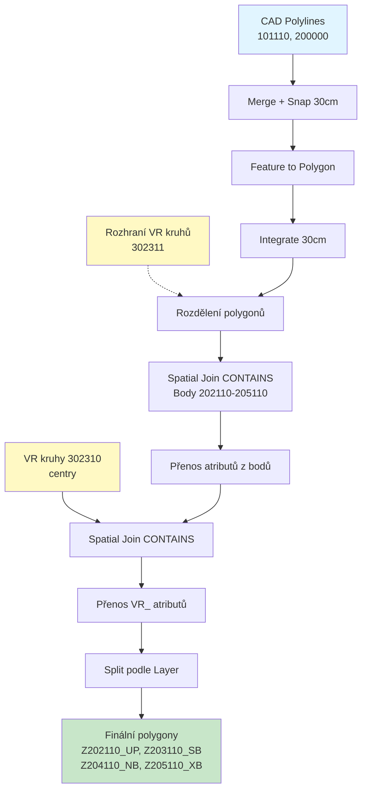
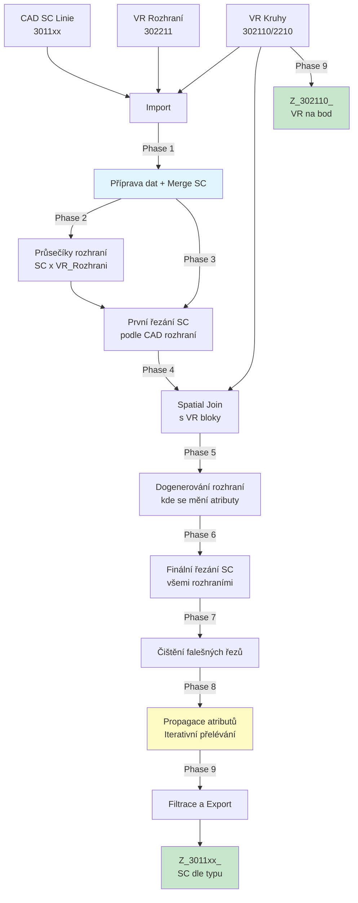

# CAD to GIS Import Toolbox

Python toolboxy pro ArcGIS Pro určené pro import a zpracování CAD dat s automatickou analýzou. Sada obsahuje dva specializované převodníky pro územní plánování.

## Přehled toolboxů

### Hlavní toolbox (Prevodnik_CAD_GIS.pyt)

**Kombinovaný toolbox** obsahující oba převodníky pod jednou kapotou.

Použití:
1. V ArcGIS Pro: Catalog Pane → Toolboxes → Add Toolbox
2. Vyberte: `Prevodnik_CAD_GIS.pyt`
3. V toolboxu uvidíte oba nástroje:
   - Import CAD do GIS (Řešená území)
   - Import CAD do GIS (Výšky)

Poznámka: Tento toolbox automaticky importuje nástroje ze samostatných souborů ReseneUzemi a Vysky, takže ty musí zůstat ve stejné složce.

### 1. Převodník Řešených území (Prevodnik_CAD_GIS_ReseneUzemi.pyt)

Samostatný toolbox pro import a analýzu hraničních území s kontrolou bodů.

Hlavní funkce:
- Převod polyline vrstev do polygonů se geometrickým čištěním
- Prostorová analýza bodových vrstev a jejich propojení s polygony
- Automatické vyčištění geometrie s tolerancí 30 cm
- Vytváření samostatných vrstev dle typu a detekce problematických prvků
- Rozdělení polygonů podle výškových rozhraní (302311)
- Přenos výškových atributů z kruhů (302310)

Workflow Řešených území:

Vstupní vrstvy:
- 101110_PL_Resene_uzemi (Polyline)
- 200000_PL_Cast_uzemi (Polyline)
- 101111_BL_Resene_uzemi (Point)
- 202110_BL_Cast_uzemi_UP (Point)
- 203110_BL_Cast_uzemi_SB (Point)
- 204110_BL_Cast_uzemi_NB (Point)
- 205110_BL_Cast_uzemi_XB (Point)
- 302310_BL_VR_na_plochu (Polyline)
- 302311_PL_VR_na_plochu_rozhrani (Polyline)

### 2. Převodník Výšek (Prevodnik_CAD_GIS_Vysky_v2.pyt)

**NOVÁ VERZE (v2) - SplitLine Metoda**

Tento nástroj používá pokročilou metodu řezání linií (SplitLine logic) namísto starší metody generování os (Centerline). Metoda je robustnější, přesnější a nevyžaduje generování polygonových bufferů ani externí knihovny.

Hlavní funkce:
- **Inteligentní propagace atributů**: Přenáší výškové kódy po síti linií, ale respektuje fyzická rozhraní (zdi, hranice).
- **Detekce rozhraní**: Automaticky detekuje, kde se mění výškové poměry.
- **Topologická čistota**: Výsledkem jsou čisté linie přesně kopírující CAD předlohu.
- **Strict Filtering**: Výstup obsahuje pouze validní data dle přísného schématu.

Workflow Výšek:

#### Detailní postup zpracování (Phases):

1.  **Fáze 1: Import a Příprava**: Načtení všech vybraných CAD vrstev, standardizace názvů, merge všech SC linií do jedné sítě (při zachování informace o typu SC).
2.  **Fáze 2: Body rozhraní**: Identifikace průsečíků mezi SC liniemi a vrstvou "VR rozhraní" (302211). Vytvoření řezných bodů.
3.  **Fáze 3: První řezání**: Rozdělení SC linií v místech explicitních CAD rozhraní.
4.  **Fáze 4: Spatial Join**: Připojení atributů z VR bloků (kruhů) k segmentům SC linií.
5.  **Fáze 5: Generování rozhraní**: Analýza segmentů, kde se mění atributy (např. výška 10m vs 12m), a dogenerování chybějících rozhraní v těchto stycích.
6.  **Fáze 6: Finální řezání**: Kompletní rozdělení sítě všemi (CAD i dogenerovanými) rozhraními.
7.  **Fáze 7: Čištění**: Sloučení "falešných" řezů, které vznikly technicky, ale netvoří reálné rozhraní atributů.
8.  **Fáze 8: Propagace atributů**: Klíčová fáze. Atributy se "rozlévají" ze segmentů, které protly kruh, do sousedních segmentů bez dat.
    *   *Bariéry*: Propagace se zastaví o body rozhraní (z Fáze 2).
    *   *Pravidla*: Atributy nepřechází mezi různými typy čar (SC_TYPE) nebo různými entitami (ORIG_FID), pokud to není explicitně povoleno.
9.  **Fáze 9: Filtrace a Export**:
    *   Rozdělení zpět do vrstev podle `SC_TYPE`.
    *   Export pouze vrstev `3011xx` a `302110`.
    *   Odstranění všech pomocných a systémových polí.
10. **Fáze 10: Cleanup**: Smazání dočasných a mezilehlých vrstev.

#### Vstupní vrstvy:
- **3011xx_PL_SC_***: Stavební čáry (uzavřená, polouzavřená, otevřená, volná...).
- **302110_BL_VR_na_bod**: Výškové kruhy na bod (přenáší se 1:1).
- **302210_BL_VR_na_linii**: Výškové kruhy na linii (zdroj atributů pro SC).
- **302211_PL_VR_na_linii_rozhrani**: Definují hranice, přes které se atributy nesmí propagovat.

#### Výstupy:

Finální vrstvy v geodatabázi:
- `Z_301110_PL_SC_uzavrena`
- `Z_301111_PL_SC_polouzavrena`
- `Z_301112_PL_SC_otevrena`
- `Z_301113_PL_SC_volna`
- `Z_301114_PL_SC_bez_rozliseni`
- `Z_301115_PL_SC_jina_XX`
- `Z_302110_BL_VR_na_bod`

#### Atributové schéma:
Výstup obsahuje POUZE tato pole:
- **Identifikace**: `OZNACENI`, `NAZEV_BLOK`, `DOK_NAZEV`
- **Regulativy**: `DRUH_UP`, `DRUH_INFO`
- **Výšky**: `NP_MAX`, `NUP_MAX`, `RIMSA_MAX`, `VYSKA_VB`, `VYSKA_VB_I`

Poznámka: Pole jako `Shape_Length`, `Shape_Area` a `OBJECTID` jsou spravována systémem.

## Instalace a Konfigurace

### Požadavky
- **ArcGIS Pro** 2.8+
- Standardní Python prostředí (arcgispro-py3)
- **Žádné externí knihovny** (centerline již není potřeba)

### Nastavení parametrů
- **Search Radius pro Split**: 0.001m (měnit jen při problémech s topologií)
- **XY Tolerance**: 0.01m (standard)

## Řešení problémů (Výšky)

*   **Chybějící atributy u některých linií**:
    *   Zkontrolujte, zda je VR kruh (302210) správně umístěn a protíná linii.
    *   Zkontrolujte, zda mezi kruhem a linií není nechtěné rozhraní (302211).
    *   Zvyšte počet iterací propagace (v kódu), pokud je síť velmi složitá.

*   **Atributy "přetekly" kam neměly**:
    *   Chybí rozhraní (302211) v místě, kde se má změnit výškový režim.
    *   Doplňte linii rozhraní do CADu.

*   **Chyba "Output Feature Class already exists"**:
    *   Skript automaticky přidává číselné suffixy (`_1`, `_2`), ale doporučuje se čistit cílovou GDB.

---
*Aktualizováno: Únor 2026*
*Metoda: SplitLine v2 logic*
