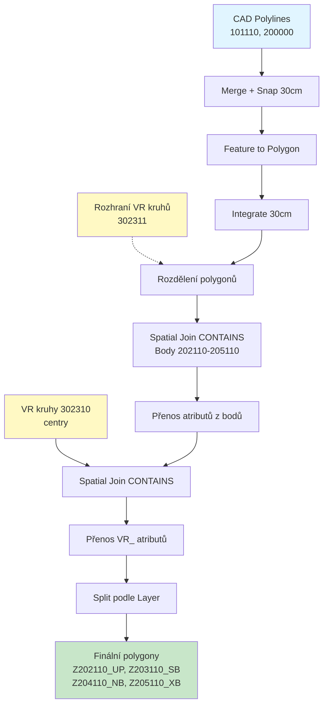
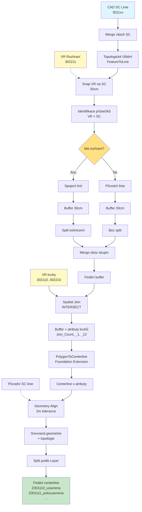
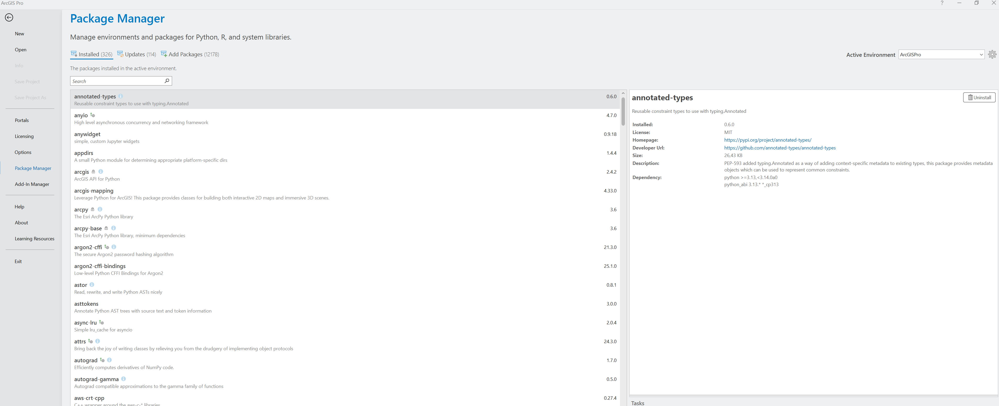
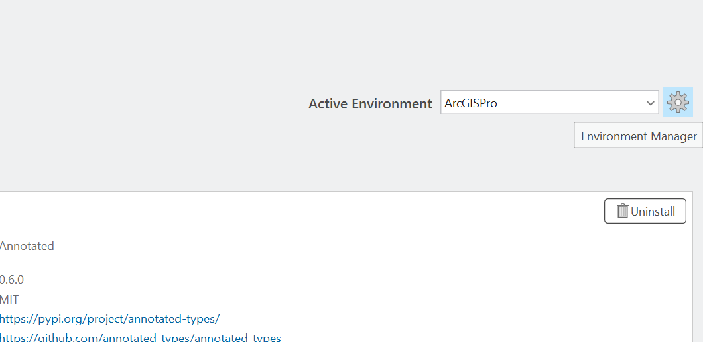
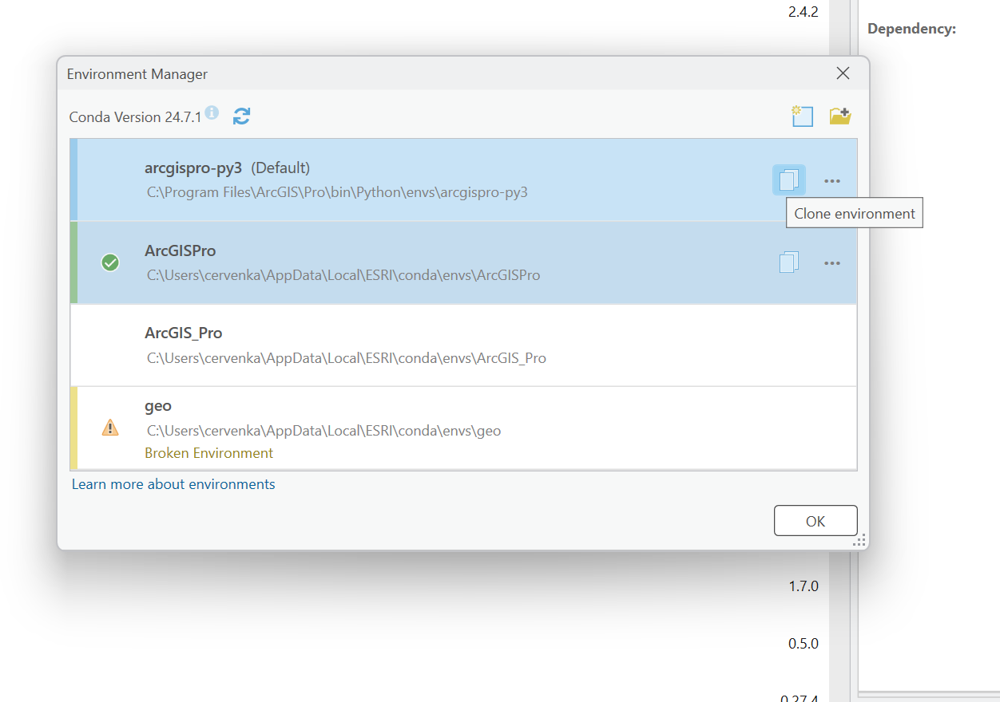
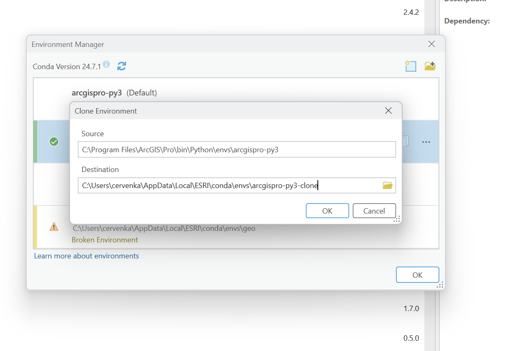
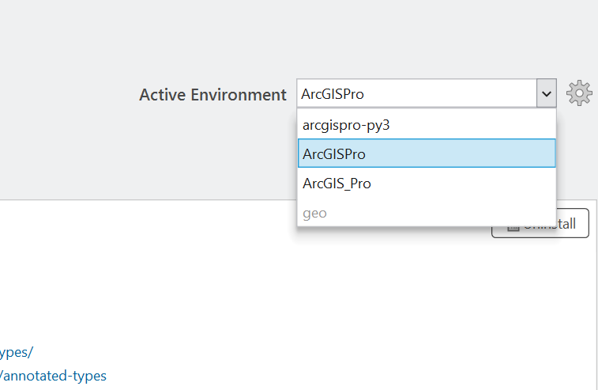
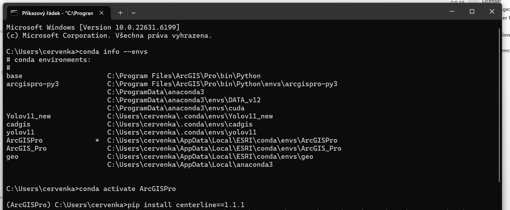
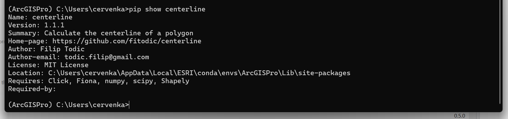

# CAD to GIS Import Toolbox

Python toolboxy pro ArcGIS Pro určené pro import a zpracování CAD dat s automatickou analýzou. Sada obsahuje dva specializované převodníky pro územní plánování.

## Přehled toolboxů


### 1. Převodník Řešených území (Prevodnik_CAD_GIS_ReseneUzemi.pyt)

Import a analýza hraničních území s kontrolou bodů

Hlavní funkce:
- Převod polyline vrstev do polygonů se geometrickým čištěním
- Prostorová analýza bodových vrstev a jejich propojení s polygony
- Automatické vyčištění geometrie s tolerancí 30 cm
- Vytváření samostatných vrstev dle typu a detekce problematických prvků
- Rozdělení polygonů podle výškových rozhraní (302311)
- Přenos výškových atributů z kruhů (302310) na polygony s prefixem VR_

Workflow Řešených území:



Vstupní vrstvy:
- 101110_PL_Resene_uzemi (Polyline) - hranice řešeného území
- 200000_PL_Cast_uzemi (Polyline) - hranice částí území
- 101111_BL_Resene_uzemi (Point) - kontrolní bod řešeného území
- 202110_BL_Cast_uzemi_UP (Point) - body územního plánu
- 203110_BL_Cast_uzemi_SB (Point) - body stavebních bloků
- 204110_BL_Cast_uzemi_NB (Point) - body nadzemních budov
- 205110_BL_Cast_uzemi_XB (Point) - body ostatních objektů
- 302310_BL_VR_na_plochu (Polyline) - výškové kruhy na plochu
- 302311_PL_VR_na_plochu_rozhrani (Polyline) - výškové rozhraní ploch

### 3. Převodník Výšek (Prevodnik_CAD_GIS_Vysky.pyt)

Import a zpracování výškových regulativů na liniích

Hlavní funkce:
- Automatická detekce všech SC vrstev (301110-301119 a další)
- Merge stavebních čar s pokročilým topologickým čištěním
- Snap výškových rozhraní (VR) na stavební čáry
- Rozdělení bufferů podle rozhraní pomocí kolmých řezných čar
- Vytvoření centerline z bufferů s zachováním atributů
- Geometrické srovnání s původními liniemi
- Fallback režim při absenci rozhraní (302211)

Workflow Výšek:



Vstupní vrstvy:
- 3011xx_PL_SC_* - stavební čáry všech typů (automatická detekce)
- 302110_BL_VR_na_bod (Polyline) - výškové kruhy na bod
- 302210_BL_VR_na_linii (Polyline) - výškové kruhy na linii
- 302211_PL_VR_na_linii_rozhrani (Polyline) - výškové rozhraní linií (volitelné)

## Společné funkce

Automatické zpracování:
- Validace názvů s sanitizací speciálních znaků
- Automatické generování jedinečných názvů
- Automatická detekce a reprojekce souřadnicových systémů (default S-JTSK EPSG:5514)
- Geometrické tolerance: XY tolerance 0.01m, XY resolution 0.001m

## Výstupy

### Převodník Řešených území

Polygonové vrstvy:
- ZResene_uzemi_PL - polygony vytvořené z linií
- Z202110_BL_Cast_uzemi_UP - polygony podle Layer atributu
- Z203110_BL_Cast_uzemi_SB - polygony podle Layer atributu
- Z204110_BL_Cast_uzemi_NB - polygony podle Layer atributu
- Z205110_BL_Cast_uzemi_XB - polygony podle Layer atributu
- ZResene_uzemi_Polygon_with_Points - polygon území s analýzou bodů

Vrstvy s problémovými prvky:
- ZPolygony_bez_bodu - polygony bez připojeného bodu (Join_Count = 0)
- ZPolygony_vice_bodu - polygony s více body (Join_Count > 1)
- ZPolygony_mimo_uzemi - polygony mimo hranice řešeného území

Ostatní vrstvy:
- Z101110_PL_Resene_uzemi_LN - původní linie území
- Z200000_PL_Cast_uzemi_LN - původní linie částí území

### Převodník Výšek

Hlavní výstupy:
- Z3011xx_PL_SC_* - centerline vrstvy rozdělené podle typu SC
- Z302110_BL_VR_na_bod - výškové kruhy na bod (pouze kruhy)

Atributy zachované v centerline:
- **Layer**: Identifikace původní SC vrstvy (301110, 301111, atd.) - potřebné pro split
- **Join_Count**: Počet kruhů které se protínají s centerline
- **Výškové atributy**: VYSKA_VB, VYSKA_VB_I, VYSKA_VB_D
- **Regulační hodnoty**: NP_MIN, NP_MAX, NUP_MAX
- **Výškové limity**: RIMSA_MIN, RIMSA_MAX, VYSKA_MAX
- **Dokumentace**: NAZEV_BLOK, DOK_NAZEV
- **Klasifikace**: OZNACENI, DRUH_UP, DRUH_INFO, PODTYP

Suffixy atributů:
- **Bez suffixu**: původní atributy ze SC linie (OZNACENI, VYSKA_VB...)
- **_1**: atributy z rozhraní (302211) NEBO z kruhů pokud linie nemá rozhraní
- **_12**: atributy z kruhů (302110/302210) pokud linie má rozhraní

Poznámka: CAD metadata (Entity, Handle, Color, Linetype, atd.) se automaticky odstraňují z finálních vrstev.

## Hodnocení kvality dat (Řešená území)

Pole "bod" - status bodů:
- v pořádku (Join_Count = 1) - prvek má přiřazen právě jeden bod
- bez bodu (Join_Count = 0) - prvek nemá žádný připojený bod
- více bodů (Join_Count > 1) - prvek má připojeno více bodů

Pole "pozice_resene_uzemi":
- uvnitř řešeného území - polygon leží kompletně uvnitř hranic
- mimo řešené území - polygon leží mimo hranice

Pole výškových atributů (pokud je vrstva 302310):
- **Výškové hodnoty**: VR_VYSKA_VB, VR_VYSKA_VB_I, VR_VYSKA_VB_D
- **Regulační limity**: VR_NP_MIN, VR_NP_MAX, VR_NUP_MAX
- **Výškové rozsahy**: VR_RIMSA_MIN, VR_RIMSA_MAX, VR_VYSKA_MAX
- **Dokumentace**: VR_NAZEV_BLOK, VR_DOK_NAZEV
- **Klasifikace**: VR_OZNACENI, VR_DRUH_UP, VR_DRUH_INFO, VR_PODTYP

Pozn: Výškové body (302310) se nezapočítávají do hodnocení "bod"

## Instalace

Požadavky:
- ArcGIS Pro 2.8 nebo novější
- Python 3.x (součást ArcGIS Pro)
- Licenční úroveň Standard nebo Advanced
- Foundation/Production Mapping extension (volitelné - pro převodník výšek)
  * S Foundation extension: vytvoří se centerline pomocí PolygonToCenterline (nejlepší kvalita)
  * Bez Foundation extension: použije se Python balíček 'centerline' (Voronoi diagram)
  * Instalace fallback balíčku: pip install centerline (volitelné, pouze pokud nemáte Foundation)

Postup:
1. Stáhněte soubory:
   
   - Prevodnik_CAD_GIS_ReseneUzemi.pyt (samostatně použitelný)
   - Prevodnik_CAD_GIS_Vysky.pyt (samostatně použitelný)
2. Zkopírujte do složky s ArcGIS Pro projektem
3. V ArcGIS Pro: Catalog Pane - Toolboxes - Add Toolbox
4. Vyberte požadovaný .pyt soubor
5. Pro Kompletní toolbox musí být všechny soubory ve stejné složce

### Instalace fallback balíčku 'centerline' (pro převodník výšek bez Foundation extension)

Pokud nemáte ArcGIS Foundation extension a chcete použít alternativní metodu tvorby centerline (Voronoi diagram), musíte nainstalovat Python balíček `centerline` do ArcGIS Pro prostředí.

**Důležité**: ArcGIS Pro používá vlastní Python prostředí, proto NELZE instalovat balíčky přes systémový Python nebo běžný pip z příkazové řádky. Musíte pracovat přímo s Python prostředím ArcGIS Pro.

#### Krok 1: Klonování Python prostředí (DOPORUČENO)

⚠️ **Nikdy neinstalujte balíčky přímo do výchozího prostředí ArcGIS Pro!** Mohli byste poškodit instalaci.

1. **Otevřete ArcGIS Pro**
2. **Project** menu → **Python** → **Manage Environments**
   - Otevře se okno "Python Package Manager"
   
   
   
3. **Naklonujte výchozí prostředí**:
   - V seznamu prostředí najděte **"arcgispro-py3"** (výchozí prostředí)
   
   
   
   - Klikněte na tři tečky **⋮** vedle prostředí
   - Vyberte **"Clone"**
   - Zadejte nový název, např: **"arcgispro-py3-custom"**
   - Klikněte **"OK"**
   
   
   
   
   - Klonování trvá 5-15 minut (kopíruje se celé Python prostředí)

4. **Aktivujte naklonované prostředí**:
   - V seznamu prostředí vyberte **"arcgispro-py3-custom"**
   - Klikněte na **"Activate"** (aktivní prostředí má modrý rámeček)
   
   
   
   - Restartujte ArcGIS Pro pro aplikování změn

#### Krok 2: Instalace balíčku 'centerline' přes Command Prompt

⚠️ **Poznámka**: Balíček 'centerline' není dostupný v ArcGIS Pro Package Manageru (Add Packages), proto musí být instalován přímo přes příkazovou řádku.

1. **Najděte Python Command Prompt pro vaše naklonované prostředí**:
   
   **Varianta A - Přes Start menu (jednodušší)**:
   - Stiskněte **Windows Start**
   - Vyhledejte: **"Python Command Prompt"**
   - Měli byste vidět položku: **"Python Command Prompt (arcgispro-py3-custom)"**
   - Klikněte pravým tlačítkem → **"Run as Administrator"** (Spustit jako správce)
   
   
   
   **Varianta B - Přes ArcGIS složku**:
   - **Start** → **ArcGIS** složka → **"Python Command Prompt"**
   - Zkontrolujte, že title okna obsahuje název vašeho prostředí
   - Pokud ne, musíte aktivovat prostředí ručně (viz níže)

2. **Ověřte, že jste ve správném prostředí**:
   ```cmd
   conda info --envs
   ```
   
   Aktivní prostředí má hvězdičku (*) na začátku řádku:
   ```
   * arcgispro-py3-custom    C:\Users\...\ESRI\conda\envs\arcgispro-py3-custom
     arcgispro-py3           C:\Program Files\ArcGIS\Pro\bin\Python\envs\arcgispro-py3
   ```
   
   Pokud aktivní prostředí není správné, aktivujte ho:
   ```cmd
   conda activate arcgispro-py3-custom
   ```

3. **Ověřte verzi Pythonu**:
   ```cmd
   python --version
   ```
   Mělo by vypsat: `Python 3.x.x` (dle verze ArcGIS Pro)
   Mělo by vypsat: `Python 3.x.x` (dle verze ArcGIS Pro)

4. **Nainstalujte balíček 'centerline'**:
   
   
   **Metoda - Z PyPI**:
   ```cmd
   pip install centerline
   ```
   
   **Pro konkrétní verzi**:
   ```cmd
   pip install centerline==1.1.1
   ```
   
    Instalace trvá 1-3 minuty a stáhne i závislosti (shapely, numpy, scipy, atd.)

5. **Ověřte úspěšnou instalaci**:
   ```cmd
   pip show centerline
   ```
   
   Měl by se zobrazit výpis:
   ```
   Name: centerline
   Version: 1.1.1
   Summary: Calculate centerline from polygon geometry
   Home-page: https://github.com/fitodic/centerline
   Author: Filip Todic
   License: MIT
   Location: C:\Users\...\ESRI\conda\envs\arcgispro-py3-custom\...
   Requires: numpy, scipy, shapely, ...
   ```
   
   **Důležité**: Zkontrolujte pole "Location" - musí ukazovat do vašeho naklonovaného prostředí!
   
   


#### Shrnutí screenshotů

Ke každému kroku jsou přiloženy screenshoty ve složce `Centerline/`:

1. [1_package_manager.png](Centerline/1_package_manager.png) - Otevření Package Manageru přes Project → Python → Manage Environments
2. [2_environmnet_manager.png](Centerline/2_environmnet_manager.png) - Seznam Python prostředí (arcgispro-py3)
3. [3_clone_env.png](Centerline/3_clone_env.png) + [3_clone_env_v2.png](Centerline/3_clone_env_v2.png) - Klonování prostředí (Clone dialog)
4. [4_switch_active_env.png](Centerline/4_switch_active_env.png) - Aktivace naklonovaného prostředí (modrý rámeček)
5. [5_cmd_centerline.png](Centerline/5_cmd_centerline.png) - Instalace balíčku přes Python Command Prompt
6. [6_pip_show_centerline.png](Centerline/6_pip_show_centerline.png) - Ověření instalace pomocí `pip show centerline`

#### Řešení problémů při instalaci

**"Balíček 'centerline' není v Package Manageru"**
- **Správně** - balíček není v oficiálním PyPI pro ArcGIS Pro
- Řešení: Použijte Command Prompt a instalujte z GitHubu (viz výše)

**"'conda' is not recognized as internal or external command"**
- Nepoužíváte Python Command Prompt pro ArcGIS Pro
- Řešení: Otevřete specifický prompt přes Start → "Python Command Prompt (arcgispro-py3-custom)"

**"'pip' is not recognized as internal or external command"**
- Stejný problém jako výše - nejste ve správném prostředí
- Řešení: Používejte Python Command Prompt z ArcGIS Pro


**"Permission denied" nebo "Access denied"**
- Spusťte Python Command Prompt jako **Správce** (Run as Administrator)
- Nebo zkontrolujte oprávnění k adresáři ArcGIS Pro instalace

**Balíček je nainstalován, ale toolbox ho nevidí**
- Restartujte ArcGIS Pro
- Ověřte, že je aktivní správné Python prostředí (s nainstalovaným balíčkem)

#### Poznámky

- **Klonované prostředí zabírá cca 2-3 GB** na disku
- Při aktualizaci ArcGIS Pro se klonované prostředí **neaktualizuje automaticky** - musíte vytvořit nové
- Doporučujeme označit si vlastní prostředí podle data vytvoření, např: "arcgispro-py3-custom-2026-01"
- Seznam naklonovaných prostředí najdete v: `C:\Users\<username>\AppData\Local\ESRI\conda\envs\`

## Použití

### Univerzální převodník (Kompletni)

Základní workflow:
```
CAD soubor → Výběr režimu → Automatické zpracování → Výsledné vrstvy
```

Parametry:
- Režim zpracování - Řešená území / Výšky / Obojí
- Input CAD Soubor - cesta k DWG/DXF/DGN
- Output Geodatabáze - povinný
- Output Feature Dataset - volitelný (stejný pro oba režimy)
- XY Tolerance - 0.01 m (default)
- XY Resolution - 0.001 m (default)
- Output Souřadnicový Systém - auto/S-JTSK
- Geographic Transformation - volitelný
- Prefix jména výstupu - Z/PL_ (default podle režimu)

Režim "Obojí":
- Spustí Řešená území s prefixem "Z"
- Pak spustí Výšky s prefixem "PL_"
- Obě části použijí stejnou geodatabázi a feature dataset
- Vrstvy z Řešených území se zachovají a použijí v Výškách (pokud mají pole Layer)
- Celkový čas: součet obou částí (cca 5-40 minut dle dat)

### Samostatné toolboxy

Základní workflow:
```
CAD soubor → Načtení vrstev → Automatický výběr → Export a zpracování → Výsledné vrstvy
```

Parametry toolboxů:
- Input CAD Soubor - cesta k DWG/DXF/DGN
- CAD Vrstva(y) - automaticky předvolené
- Output Geodatabáze - povinný
- Output Feature Dataset - volitelný
- XY Tolerance - 0.01 m (default)
- XY Resolution - 0.001 m (default)
- Output Souřadnicový Systém - auto/S-JTSK
- Geographic Transformation - volitelný
- Prefix jména výstupu - Z/PL_

Spuštění:
1. Otevřete toolbox v ArcGIS Pro
2. Spusťte příslušný tool
3. Nastavte parametry (CAD soubor, geodatabáze)
4. Spusťte - vrstvy se automaticky předvyberou
5. Ověřte výsledky

## Konfigurace

Tolerance a rozlišení:
- XY Tolerance: 0.01 m (standardní nastavení)
- XY Resolution: 0.001 m (milimetrová přesnost)
- Integrate Tolerance: 0.3 m (vyčištění geometrie)
- Snap Tolerance: 0.3-1.0 m (přichycení linií)

Souřadnicový systém:
Automatická detekce z CAD souboru. Pokud není dostupný, používá se S-JTSK (EPSG:5514). Podporována automatická reprojekce.

Specifické nastavení:

Řešená území:
- Buffer tolerance: 30 cm pro geometric cleaning
- Spatial join: CONTAINS logika pro body k polygonům
- Within analysis: WITHIN logika pro detekci pozice
- Polygon split: tolerance 30 cm pro snap rozhraní

Výšky:
- Foundation extension: potřebná pro PolygonToCenterline operaci
- Cutting lines: kolmé řezné čáry automaticky generované v místech rozhraní
- Align distance: 2.0 m pro srovnání geometrie centerline
- Fallback: simple buffer pokud chybí vrstva 302211

## Řešení problémů

Společné chyby:

"ERROR 000732: Target Workspace: Dataset does not exist"
- Zkontrolujte cestu k geodatabázi
- Ověřte přístupová práva k složce

"ERROR 000354: The name contains invalid characters"
- Názvy vrstev se automaticky sanitizují
- Zvláštní znaky se nahrazují podtržítkem

Prázdné výsledky:
- Ověřte, že CAD soubor obsahuje požadované vrstvy
- Zkontrolujte, že vrstvy obsahují data
- Ověřte souřadnicový systém

Specifické problémy:

Řešená území:
- "Žádné polygony s body rozhraní" - zkontrolujte správné bodové vrstvy
- "Chyba při within analýze" - ověřte topologii polygonových dat

Výšky:
- "Foundation extension není dostupná" - použije se Python balíček 'centerline' (Voronoi diagram) pokud je nainstalován
- "Balíček 'centerline' není dostupný" - instalujte pomocí: pip install centerline, nebo budou vytvořeny pouze buffery
- "Chyba při rozdělování bufferu kolmicemi" - použije se fallback s buffer-erase logikou
- "Původní SC linie nebyly nalezeny" - geometrie centerline zůstane z PolygonToCenterline
- "VR rozhraní nebylo nalezeno" - vytvoří se jednoduchý buffer přímo ze všech SC linií bez rozdělení

## Výkonnost

Doporučená konfigurace:
- Použijte SSD disk pro geodatabázi
- Minimalizujte ostatní procesy během zpracování
- Pro CAD soubory větší než 100 MB zvažte rozdělení na menší části

Typické časy zpracování:
- Řešená území: 3-15 minut dle počtu polygonů a bodů
- Výšky: 5-25 minut dle složitosti SC sítě a počtu rozhraní

Poslední aktualizace: Prosinec 2025
Verze: 2.1
