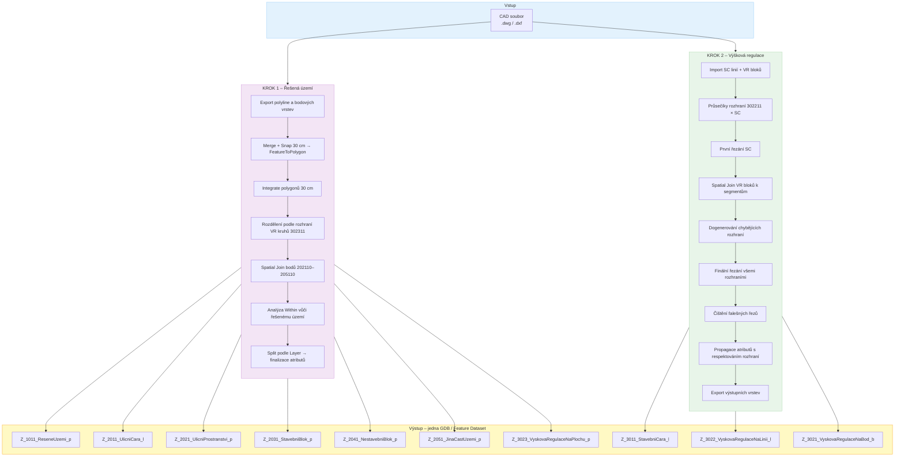
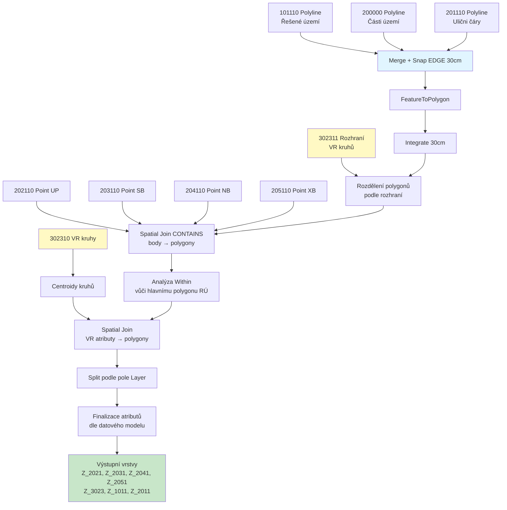
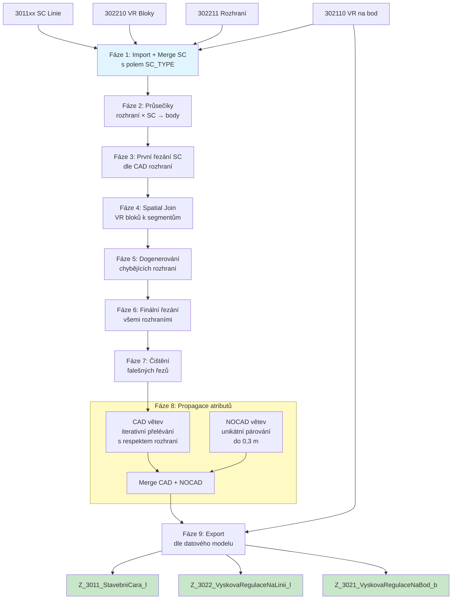

# CAD to GIS Import Toolbox – MADASPRU

Python toolboxy pro ArcGIS Pro určené pro import a zpracování CAD dat územních plánů MADASPRU. Hlavní toolbox spustí v jednom kroku kompletní import – řešená území i výšková regulace – a vše exportuje do jednoho společného datasetu.

## Struktura souborů

```
Prevodnik_CAD_GIS.pyt                  ← hlavní toolbox (jeden kombinovaný nástroj)
Prevodnik_CAD_GIS_ReseneUzemi.pyt      ← dílčí modul: řešená území
Prevodnik_CAD_GIS_Vysky.pyt            ← dílčí modul: výšková regulace
madaspru_reseneuzemi_config.json       ← konfigurace datového modelu (řešená území)
madaspru_vysky_config.json             ← konfigurace datového modelu (výšky)
```

> Všechny tři soubory musí být ve stejné složce. Hlavní toolbox dynamicky načítá kód z dílčích modulů.

---

## Hlavní toolbox – Prevodnik_CAD_GIS.pyt

### Nástroj: Import CAD do GIS (Řešená území + Výšky)

Jeden nástroj spustí za sebou dva workflow a výsledky uloží do jedné geodatabáze / Feature Datasetu.

### Parametry

| # | Název | Typ | Popis |
|---|-------|-----|-------|
| 0 | Input CAD Soubor | Soubor (.dwg/.dxf/.dgn) | Zdrojový CAD soubor |
| 1 | CAD Vrstvy | Text, více hodnot | Automaticky předvyplněno; lze upravit |
| 2 | Output Geodatabáze | File GDB | Cílová GDB |
| 3 | Output Feature Dataset | Text (volitelné) | Název FD; pokud neexistuje, vytvoří se |
| 4 | XY Tolerance (m) | Číslo | Výchozí: 0,01 m |
| 5 | XY Resolution (m) | Číslo | Výchozí: 0,001 m |

**Hardcoded hodnoty** (nelze měnit parametrem):
- Souřadnicový systém: **S-JTSK / Krovak East North (EPSG 5514)**
- Prefix výstupů: **`Z_`**
- Split radius: **0,001 m** (min. 0,3 m pro CAD větev)

### Použití

1. ArcGIS Pro → Catalog Pane → Toolboxes → Add Toolbox
2. Vyberte `Prevodnik_CAD_GIS.pyt`
3. Otevřete nástroj **Import CAD do GIS (Řešená území + Výšky)**
4. Vyplňte parametry → Run

### Celkový workflow



---

## Krok 1 – Řešená území (detail)

### Vstupní CAD vrstvy

| CAD vrstva | Typ | Popis |
|------------|-----|-------|
| 101110_PL_Resene_uzemi | Polyline | Hranice řešeného území |
| 200000_PL_Cast_uzemi | Polyline | Hranice částí území |
| 201110_PL_Ulicni_cara | Polyline | Ulični čáry |
| 101111_BL_Resene_uzemi | Point | Referenční bod řešeného území |
| 202110_BL_Cast_uzemi_UP | Point | Bloky uličních prostranství |
| 203110_BL_Cast_uzemi_SB | Point | Bloky stavebních bloků |
| 204110_BL_Cast_uzemi_NB | Point | Bloky nestavebních bloků |
| 205110_BL_Cast_uzemi_XB | Point | Bloky jiných částí území |
| 302310_BL_VR_na_plochu | Polyline | Výšková regulace na plochu (kruhy) |
| 302311_PL_VR_na_plochu_rozhrani | Polyline | Rozhraní výškových kruhů |

### Výstupní vrstvy

| Výstupní vrstva | Typ | Popis |
|-----------------|-----|-------|
| Z_1011_ReseneUzemi_p | Polygon | Polygon řešeného území |
| Z_2011_UlicniCara_l | Polyline | Ulični čáry |
| Z_2021_UlicniProstranstvi_p | Polygon | Ulični prostranství |
| Z_2031_StavebniBlok_p | Polygon | Stavební bloky |
| Z_2041_NestavebniBlok_p | Polygon | Nestavební bloky |
| Z_2051_JinaCastUzemi_p | Polygon | Jiné části území |
| Z_3023_VyskovaRegulaceNaPlochu_p | Polygon | Výšková regulace na plochu |

### Workflow detail



---

## Krok 2 – Výšková regulace (detail)

### Vstupní CAD vrstvy

| CAD vrstva | Typ | Popis |
|------------|-----|-------|
| 3011xx_PL_SC_* | Polyline | Stavební čáry (uzavřená, polouzavřená, otevřená, volná, bez rozlišení, jiná) |
| 302210_BL_VR_na_linii | Polyline | VR bloky na linii (zdroj výškových atributů) |
| 302211_PL_VR_na_linii_rozhrani | Polyline | Rozhraní VR na linii (bariéry propagace) |
| 302110_BL_VR_na_bod | Polyline | VR bloky na bod |

### Výstupní vrstvy

| Výstupní vrstva | Typ | Popis |
|-----------------|-----|-------|
| Z_3011_StavebniCara_l | Polyline | Stavební čáry dle typu (pole DRUH_SC) |
| Z_3022_VyskovaRegulaceNaLinii_l | Polyline | Výšková regulace na linii s atributy |
| Z_3021_VyskovaRegulaceNaBod_b | Point | Výšková regulace na bod |

### Výškové atributy (Z_3022)

`VYSKA_VB` · `VYSKA_VB_I` · `NP_MIN` · `NP_MAX` · `NPU_MAX` · `RIMSA_MIN` · `RIMSA_MAX` · `VYSKA_MAX`

### Workflow detail



---

## Instalace

### Požadavky
- **ArcGIS Pro** 2.8+
- Standardní Python prostředí `arcgispro-py3`
- Žádné externí knihovny

### Postup
1. Zkopírujte všechny `.pyt` a `.json` soubory do jedné složky
2. V ArcGIS Pro: Catalog Pane → Toolboxes → Add Toolbox → vyberte `Prevodnik_CAD_GIS.pyt`
3. Spusťte nástroj **Import CAD do GIS (Řešená území + Výšky)**

---

## Řešení problémů

| Problém | Příčina | Řešení |
|---------|---------|--------|
| Výstupní vrstvy mají suffix `_1`, `_2`... | Vrstvy stejného jména již existují v GDB | Použijte čistou GDB nebo jiný Feature Dataset |
| Chybějící atributy u SC linií | VR kruh (302210) neprotíná linii nebo chybí rozhraní (302211) | Zkontrolujte topologii v CADu |
| Atributy přetekly kam neměly | Chybí rozhraní (302211) na hranici výškového pásma | Doplňte linii rozhraní do CADu |
| Polygony nemají body | Body (202110–205110) neleží uvnitř polygonu | Zkontrolujte polohu bodů v CADu |

---

## Konfigurace datového modelu

Konfigurace je uložena v JSON souborech ve stejné složce jako toolboxy. Python kód ji načte při startu a použije místo hardcoded hodnot. Pokud soubor chybí nebo je poškozený, nástroj spadne zpět na výchozí hodnoty a zobrazí varování v logu.

### madaspru_reseneuzemi_config.json

Řídí chování nástroje Řešená území:

| Klíč | Popis |
|------|-------|
| `field_schema` | Typy, délky a aliasy výstupních polí (19 polí) |
| `height_attributes` | Seznam výškových atributů |
| `output_layers` | Definice výstupních vrstev — SKNAZEV, OBTYPNAZEV, povolené atributy, cílový název |
| `domain_allowed_values` | Povolené hodnoty pro DRUH_UP, DRUH_SC, VYSKA_VB |
| `domains` | Definice domén pro import do GDB |

### madaspru_vysky_config.json

Řídí chování nástroje Výšková regulace:

| Klíč | Popis |
|------|-------|
| `field_schema` | Typy a délky výstupních polí |
| `height_attributes` | Seznam výškových atributů |
| `vr_attribute_aliases` | Mapování alternativních názvů polí z CAD bloků |
| `output_layers` | Definice vrstev Z_3011, Z_3021, Z_3022 |
| `domain_allowed_values` | Povolené hodnoty pro DRUH_SC, VYSKA_VB |
| `domains` | Definice domén pro import do GDB |
| `sc_druh_mapping` | Mapování čísla CAD vrstvy → kód DRUH_SC |
| `processing` | Procesní parametry (tolerance NOCAD větve) |

### Jak upravit konfiguraci

Příklad — přidat novou povolenou hodnotu pro DRUH_SC:

```json
"domain_allowed_values": {
    "DRUH_SC": ["SCU", "SCPU", "SCO", "SCV", "SC", "SCX", "SCN"]
}
```

Příklad — přidat nové výstupní pole:

```json
"field_schema": {
    "POZNAMKA": {"type": "TEXT", "length": 500, "alias": "POZNAMKA"}
}
```

Změny se projeví při příštím spuštění nástroje — není třeba editovat `.pyt` soubory.

---

*Aktualizováno: Květen 2026*
