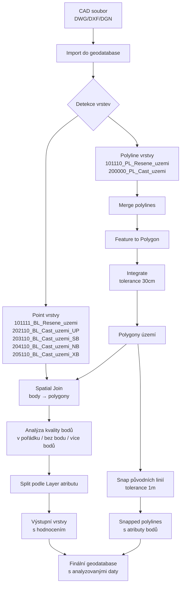
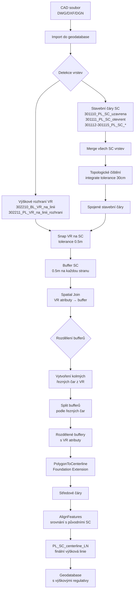

# CAD to GIS Import Toolbox

Python toolboxy pro ArcGIS Pro určené pro import a zpracování CAD dat s automatickou analýzou. Sada obsahuje dva specializované převodníky pro územní plánování.

## Přehled toolboxů

### 1. Převodník Řešených území (Prevodnik_CAD_GIS_ReseneUzemi.pyt)

Import a analýza hraničních území s kontrolou bodů

Hlavní funkce:
- Převod polyline vrstev do polygonů se geometrickým čištěním
- Prostorová analýza bodových vrstev a jejich propojení s polygony
- Automatické vyčištění geometrie s tolerancí 30 cm
- Vytváření samostatných vrstev dle typu a detekce problematických prvků
- Rozdělení polygonů podle výškových rozhraní (302311)
- Přenos výškových atributů z kruhů (302310) na polygony s prefixem VR_

Vstupní vrstvy:
- 101110_PL_Resene_uzemi (Polyline) - hranice řešeného území
- 200000_PL_Cast_uzemi (Polyline) - hranice částí území
- 101111_BL_Resene_uzemi (Point) - kontrolní bod řešeného území
- 202110_BL_Cast_uzemi_UP (Point) - body územního plánu
- 203110_BL_Cast_uzemi_SB (Point) - body stavebních bloků
- 204110_BL_Cast_uzemi_NB (Point) - body nadzemních budov
- 205110_BL_Cast_uzemi_XB (Point) - body ostatních objektů
- 302310_BL_VR_na_plochu (Polyline) - výškové kruhy na plochu
- 302311_PL_VR_na_plochu_rozhrani (Polyline) - výškové rozhraní ploch

### 2. Převodník Výšek (Prevodnik_CAD_GIS_Vysky.pyt)

Import a zpracování výškových regulativů na liniích

Hlavní funkce:
- Automatická detekce všech SC vrstev (301110-301119 a další)
- Merge stavebních čar s pokročilým topologickým čištěním
- Snap výškových rozhraní (VR) na stavební čáry
- Rozdělení bufferů podle rozhraní pomocí kolmých řezných čar
- Vytvoření centerline z bufferů s zachováním atributů
- Geometrické srovnání s původními liniemi
- Fallback režim při absenci rozhraní (302211)

Vstupní vrstvy:
- 3011xx_PL_SC_* - stavební čáry všech typů (automatická detekce)
- 302110_BL_VR_na_bod (Polyline) - výškové kruhy na bod
- 302210_BL_VR_na_linii (Polyline) - výškové kruhy na linii
- 302211_PL_VR_na_linii_rozhrani (Polyline) - výškové rozhraní linií (volitelné)

## Společné funkce

Automatické zpracování:
- Validace názvů s sanitizací speciálních znaků
- Automatické generování jedinečných názvů
- Automatická detekce a reprojekce souřadnicových systémů (default S-JTSK EPSG:5514)
- Geometrické tolerance: XY tolerance 0.01m, XY resolution 0.001m

## Výstupy

### Převodník Řešených území

Polygonové vrstvy:
- ZResene_uzemi_PL - polygony vytvořené z linií
- Z202110_BL_Cast_uzemi_UP - polygony podle Layer atributu
- Z203110_BL_Cast_uzemi_SB - polygony podle Layer atributu
- Z204110_BL_Cast_uzemi_NB - polygony podle Layer atributu
- Z205110_BL_Cast_uzemi_XB - polygony podle Layer atributu
- ZResene_uzemi_Polygon_with_Points - polygon území s analýzou bodů

Vrstvy s problémovými prvky:
- ZPolygony_bez_bodu - polygony bez připojeného bodu (Join_Count = 0)
- ZPolygony_vice_bodu - polygony s více body (Join_Count > 1)
- ZPolygony_mimo_uzemi - polygony mimo hranice řešeného území

Ostatní vrstvy:
- Z101110_PL_Resene_uzemi_LN - původní linie území
- Z200000_PL_Cast_uzemi_LN - původní linie částí území

### Převodník Výšek

Hlavní výstupy:
- Z3011xx_PL_SC_* - centerline vrstvy rozdělené podle typu SC
- Z302110_BL_VR_na_bod - výškové kruhy na bod (pouze kruhy)

Atributy zachované v centerline:
- Layer, Join_Count (počet kruhů)
- VYSKA_VB, VYSKA_VB_I, VYSKA_VB_D
- NP_MIN, NP_MAX, NUP_MAX
- RIMSA_MIN, RIMSA_MAX, VYSKA_MAX
- NAZEV_BLOK, DOK_NAZEV
- OZNACENI, DRUH_UP, DRUH_INFO, PODTYP

Suffixy: _1 (rozhraní nebo kruhy pokud bez rozhraní), _12 (kruhy pokud s rozhraním)

## Workflow diagramy

### Převodník Řešených území - proces zpracování



### Převodník Výšek - proces zpracování



---

## Výstupy dle převodníku

### **Řešená území - Výstupní vrstvy**

#### Polygonové vrstvy
- **ZResene_uzemi_PL** - zaplněné polygony vytvořené z linií (veškeré části území)
- **Z202110_BL_Cast_uzemi_UP** - polygony filtrované podle Layer atributu
- **Z203110_BL_Cast_uzemi_SB** - polygony filtrované podle Layer atributu
- **Z204110_BL_Cast_uzemi_NB** - polygony filtrované podle Layer atributu
- **Z205110_BL_Cast_uzemi_XB** - polygony filtrované podle Layer atributu
- **ZResene_uzemi_Polygon_with_Points** - polygon řešeného území s analýzou bodu

#### Vrstvy s problémovými prvky
- **ZPolygony_bez_bodu** - polygony bez připojeného bodu (Join_Count = 0)
- **ZPolygony_vice_bodu** - polygony s více připojenými body (Join_Count > 1)
- **ZPolygony_mimo_uzemi** - polygony mimo hranice řešeného území

#### Ostatní vrstvy
- **Z101110_PL_Resene_uzemi_LN** - původní linie řešeného území (zachované)
- **Z200000_PL_Cast_uzemi_LN** - původní linie částí území (zachované)

### **Výšky - Výstupní vrstvy**

#### Hlavní výstup
- **PL_SC_centerline_LN** - finální centerline s atributy výšek a geometricky srovnaná

#### Mezivýstupy (mohou být zachovány)
- **PL_SC_all_LN** - sloučené stavební čáry před zpracováním
- **PL_SC_final_buffer** - finální buffer se správným rozdělením podle rozhraní
- **PL_302210_VR_circles_LN** - výškové kruhy (uzavřené linie)
- **PL_SC_buffer_with_circles** - buffer s připojenými informacemi o kruzích

---

## Hodnocení kvality dat (Řešená území)

Pole "bod" - status bodů:
- v pořádku (Join_Count = 1) - prvek má přiřazen právě jeden bod
- bez bodu (Join_Count = 0) - prvek nemá žádný připojený bod
- více bodů (Join_Count > 1) - prvek má připojeno více bodů

Pole "pozice_resene_uzemi":
- uvnitř řešeného území - polygon leží kompletně uvnitř hranic
- mimo řešené území - polygon leží mimo hranice

Pole výškových atributů (pokud je vrstva 302310):
- VR_VYSKA_VB, VR_VYSKA_VB_I, VR_VYSKA_VB_D
- VR_NP_MIN, VR_NP_MAX, VR_NUP_MAX
- VR_RIMSA_MIN, VR_RIMSA_MAX, VR_VYSKA_MAX
- VR_NAZEV_BLOK, VR_DOK_NAZEV, VR_OZNACENI, VR_DRUH_UP, VR_DRUH_INFO, VR_PODTYP

Pozn: Výškové body (302310) se nezapočítávají do hodnocení "bod"

## Instalace

Požadavky:
- ArcGIS Pro 2.8 nebo novější
- Python 3.x (součást ArcGIS Pro)
- Licenční úroveň Standard nebo Advanced
- Foundation/Production Mapping extension (pouze pro převodník výšek - centerline funkce)

Postup:
1. Stáhněte soubory Prevodnik_CAD_GIS_ReseneUzemi.pyt a Prevodnik_CAD_GIS_Vysky.pyt
2. Zkopírujte do složky s ArcGIS Pro projektem
3. V ArcGIS Pro: Catalog Pane - Toolboxes - Add Toolbox
4. Vyberte požadovaný .pyt soubor

## Použití

Základní workflow:
   - `Prevodnik_CAD_GIS_ReseneUzemi.pyt` (pro řešená území)
   - `Prevodnik_CAD_GIS_Vysky.pyt` (pro výšky)
2. Zkopírujte do složky s vaším ArcGIS Pro projektem
3. V ArcGIS Pro přidejte toolboxy:
   - **Catalog Pane → Toolboxes → Add Toolbox**
   - Vyberte požadovaný `.pyt` soubor

---

## Použití

### Výběr správného převodníku

| Typ dat | Použijte převodník | Toolbox Label |
|---------|-------------------|---------------|
| Hranice území + kontrolní body | Řešená území | "CAD Import Tools - Řešená území" |
| Stavební čáry + výškové rozhraní | Výšky | "MADASPRU CAD Import - Výšky" |

### Základní workflow

```
CAD soubor → Výběr převodníku → Načtení vrstev → Automatický výběr → Export a zpracování → Výsledné vrstvy
```

### Společné parametry toolboxů

| Parametr | Typ | Popis | Výchozí hodnota |
|----------|-----|-------|-----------------|
| Input CAD Soubor | DEFile | Cesta k CAD souboru (DWG, DXF, DGN) | - |
| CAD Vrstva(y) | GPString | Vrstvy pro zpracování (automaticky předvolené) | Auto |
| Output Geodatabáze | DEWorkspace | Cílová geodatabáze | Povinný |
| Output Feature Dataset | GPString | Cílový feature dataset (volitelný) | - |
| XY Tolerance | GPDouble | Tolerancia XY v metrech | 0.01 |
| XY Resolution | GPDouble | Rozlišení XY v metrech | 0.001 |
| Output Souřadnicový Systém | GPSpatialReference | Výstupní souřadnicový systém | Auto z CAD/S-JTSK |
| Geographic Transformation | GPString | Transformace souřadnic (volitelná) | - |
| Prefix jména výstupu | GPString | Prefix pro názvy výstupních vrstev | Z/PL_ |

### Spuštění toolboxu

1. Otevřete toolbox v ArcGIS Pro
2. Spusťte příslušný tool:
   - **"Import CAD do GIS (Řešená území)"**
   - **"Import CAD vrstev (Výšky)"**
3. Nastavte parametry:
   - Vyberte CAD soubor
   - Zvolte výstupní geodatabázi
   - Volitelně nastavte feature dataset a další parametry
4. Spusťte tool - vrstvy se automaticky předvyberou
5. Ověřte výsledky v geodatabázi

### Základní workflow

```
CAD soubor → Načtení vrstev → Automatický výběr → Export a zpracování → Výsledné vrstvy
```

### Parametry toolboxu

| Parametr | Typ | Popis | Výchozí hodnota |
|----------|-----|-------|-----------------|
| Input CAD Soubor | DEFile | Cesta k CAD souboru (DWG, DXF, DGN) | - |
| CAD Vrstva(y) | GPString | Vrstvy pro zpracování (automaticky předvolené) | Auto |
| Output Geodatabáze | DEWorkspace | Cílová geodatabáze | Povinný |
| Output Feature Dataset | GPString | Cílový feature dataset (volitelný) | - |
| XY Tolerance | GPDouble | Tolerancia XY v metrech | 0.01 |
| XY Resolution | GPDouble | Rozlišení XY v metrech | 0.001 |
| Output Souřadnicový Systém | GPSpatialReference | Výstupní souřadnicový systém | Auto z CAD |
| Geographic Transformation | GPString | Transformace souřadnic (volitelná) | - |
| Prefix jména výstupu | GPString | Prefix pro názvy výstupních vrstev | Z |

### Spuštění toolboxu

1. Otevřete toolbox v ArcGIS Pro
2. Spusťte tool "Import CAD do GIS"
3. Nastavte parametry:
   - Vyberte CAD soubor
   - Zvolte výstupní geodatabázi
   - Volitelně nastavte feature dataset a další parametry
4. Spusťte tool - vrstvy se automaticky předvyberou
5. Ověřte výsledky v geodatabázi

## Výstupní vrstvy

### Polygonové vrstvy
- **ZResene_uzemi_PL** - zaplněné polygony vytořené z linií (veškeré části území)
- **Z202110_BL_Cast_uzemi_UP** - polygony filtrované podle Layer atributu
- **Z203110_BL_Cast_uzemi_SB** - polygony filtrované podle Layer atributu
- **Z204110_BL_Cast_uzemi_NB** - polygony filtrované podle Layer atributu
- **Z205110_BL_Cast_uzemi_XB** - polygony filtrované podle Layer atributu
- **ZResene_uzemi_Polygon_with_Points** - polygon řešeného území s analýzou bodu

### Vrstvy s problémovými prvky
- **ZPolygony_bez_bodu** - polygony bez připojeného bodu (Join_Count = 0)
- **ZPolygony_vice_bodu** - polygony s více připojenými body (Join_Count > 1)
- **ZPolygony_mimo_uzemi** - polygony mimo hranice řešeného území

### Ostatní vrstvy
- **Z101110_PL_Resene_uzemi_LN** - původní linie řešeného území (zachované)
- **Z200000_PL_Cast_uzemi_LN** - původní linie částí území (zachované)
## Hodnocení kvality dat

### Pole "bod" - status bodů
| Hodnota | Podmínka | Popis |
|---------|----------|-------|
| v pořádku | Join_Count = 1 | Prvek má přiřazen právě jeden bod |
| bez bodu | Join_Count = 0 | Prvek nemá žádný připojený bod |
| více bodů | Join_Count > 1 | Prvek má připojeno více bodů |

### Pole "pozice_resene_uzemi" - poloha vůči řešenému území
| Hodnota | Popis |
|---------|-------|
| uvnitř řešeného území | Polygon leží kompletně uvnitř hranic řešeného území |
| mimo řešené území | Polygon leží mimo hranice řešeného území |

## Konfigurace

### Tolerance a rozlišení
- **XY Tolerance**: 0.01 m (standardní nastavení)
- **XY Resolution**: 0.001 m (milimetrová přesnost)
- **Integrate Tolerance**: 0.3 m (vyčištění geometrie - oba převodníky)
- **Snap Tolerance**: 0.3-1.0 m (přichycení linií - dle převodníku)

### Souřadnicový systém
Oba toolboxy automaticky detekují souřadnicový systém z CAD souboru. Pokud není dostupný, používají **S-JTSK (EPSG:5514)**. Podporují automatickou reprojekci při změně cílového systému.

### Specifické nastavení převodníků

#### Řešená území
- **Buffer tolerance**: 30 cm pro geometric cleaning
- **Spatial join**: CONTAINS logika pro body k polygonům
- **Within analysis**: WITHIN logika pro detekci pozice vůči řešenému území

#### Výšky  
- **Foundation extension**: Potřebná pro PolygonToCenterline operaci
- **Cutting lines**: Kolmé řezné čáry automaticky generované v místech rozhraní
- **Align distance**: 2.0 m pro srovnání geometrie centerline s původními liniemi

---

## Řešení problémů

### Společné chyby

**"ERROR 000732: Target Workspace: Dataset does not exist"**
- Zkontrolujte cestu k geodatabázi
- Ověřte přístupová práva k složce

**"ERROR 000354: The name contains invalid characters"**
- Názvy vrstev se automaticky sanitizují
- Zvláštní znaky se nahrazují podtržítkem

**Prázdné výsledky**
- Ověřte, že CAD soubor obsahuje požadované vrstvy
- Zkontrolujte, že vrstvy obsahují data
- Ověřte souřadnicový systém

### Specifické problémy dle převodníku

#### Řešená území
**"Žádné polygony s body rozhraní"**
- Zkontrolujte, zda CAD obsahuje správné bodové vrstvy
- Ověřte spatial reference bodů a polygonů

**"Chyba při within analýze"**
- Zkontrolujte, zda hlavní polygon řešeného území je platný
- Ověřte topologii polygonových dat

#### Výšky
**"Foundation/Production Mapping extension není dostupná"**
- Centerline funkce vyžaduje Foundation nebo Production Mapping extension
- Bez této licence se vytvoří pouze buffery, ne centerline

**"Chyba při rozdělování bufferu kolmicemi"**
- Použije se fallback strategie s buffer-erase logikou
- Zkontrolujte, zda jsou průsečíky správně detekované

**"Původní SC linie nebyly nalezeny pro align"**
- Geometrie centerline zůstane z PolygonToCenterline (může být zaoblená)
- Zkontrolujte, zda se merge SC vrstev provedl úspěšně

---

## Výstupní logy

Oba toolboxy poskytují detailní informace v okně zpráv:

### Řešená území
- **[export]** - informace o exportu jednotlivých vrstev
- **[process_polylines_to_polygon]** - zpracování polyline vrstev
- **[perform_spatial_join_analysis]** - výsledky prostorové analýzy
- **[split_analysis_by_layer]** - rozdělení vrstev podle atributu
- **[add_within_analysis]** - analýza polohy vůči řešenému území

### Výšky
- **[export]** - informace o exportu SC a VR vrstev
- **SC linie snapped**, **Buffer vytvořen** - geometrické operace
- **Kolmých řezných čar vytvořeno** - rozdělení bufferu
- **Centerline vytvořena**, **Atributy připojeny** - finální zpracování
- **Geometrie srovnána** - align s původními liniemi

---

## Výkonnost

### Doporučená konfigurace pro optimální výkon:
- Použijte **SSD disk** pro geodatabázi
- Minimalizujte ostatní procesy během zpracování
- Pro CAD soubory **> 100 MB** zvažte rozdělení na menší části

### Typické časy zpracování:
- **Řešená území**: 3-15 minut dle počtu polygonů a bodů
- **Výšky**: 5-25 minut dle složitosti SC sítě a počtu rozhraní

---


---
**Poslední aktualizace**: Říjen 2025  
**Verze**: 2.0 (Kompletní sada - Řešená území + Výšky)
